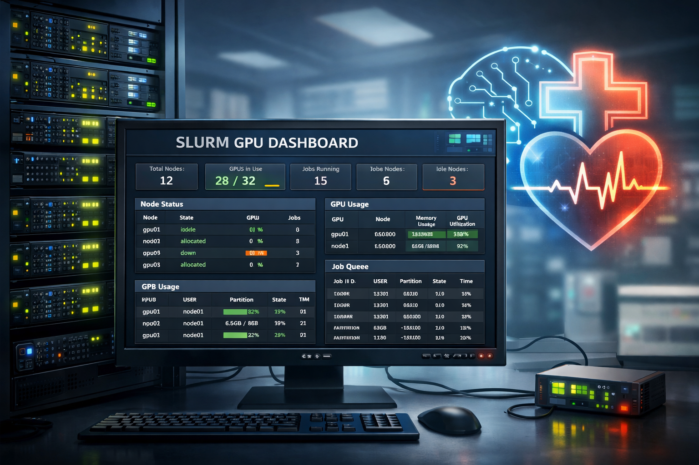

# h4h_slurm_dashboard

Lightweight read-only dashboard for SLURM cluster status, GPU/node occupancy, and job visibility.

This app is designed for internal HPC use:
- run it on a cluster node
- bind it to `127.0.0.1`
- access it from your laptop through SSH port forwarding

## What It Shows

- cluster summary cards
- node state: `idle`, `allocated`, `mixed`, `down`, `drained`
- CPU and memory usage by node
- GPU count and GPU type by node
- job list with owner, partition, state, runtime, and GRES
- per-column table filters
- auto-refresh plus a manual `Refresh now` button

## Current Live-Mode Design

The dashboard supports two practical live modes.

### 1. Recommended: run on a GPU node

If you run the app on a GPU node:
- cluster-wide node/job state comes from SLURM
- local GPU details can come from `nvidia-smi` on that node

This is the best mode if you want both:
- real cluster-wide scheduler state
- real local GPU telemetry

### 2. SLURM-only live mode

If cross-node GPU probing is blocked or `nvidia-smi` is not available on the host:
- node/job state still comes from SLURM
- GPU occupancy falls back to SLURM allocation metadata
- per-GPU live memory/utilization is not shown

This is still useful and usually the safest cluster-wide deployment mode.

## Requirements

- Python
- `uv`
- access to SLURM commands such as:
  - `scontrol`
  - `squeue`
- optional: `nvidia-smi` on the node where the dashboard runs

## Install

From the project directory:

```bash
cd /path/to/h4h_slurm_dashboard
uv venv
uv pip install --python .venv/bin/python -r requirements.txt
```

You can verify the environment with:

```bash
uv run python -c "import fastapi, jinja2, uvicorn; print('ok')"
```

## Run The Dashboard

### Mock mode

Useful for UI work and offline development:

```bash
uv run uvicorn app.main:app --host 127.0.0.1 --port 8000
```

### Live mode

Recommended helper:

```bash
./run_live_dashboard.sh
```

This script sets:
- `DASHBOARD_DATA_SOURCE=live`
- `DASHBOARD_GPU_QUERY_MODE=local`
- `DASHBOARD_ENABLE_GPU_TELEMETRY=true`

and starts:

```bash
uv run uvicorn app.main:app --host 127.0.0.1 --port 8000
```

### SLURM-only live mode

If the node does not have usable local GPU telemetry:

```bash
DASHBOARD_ENABLE_GPU_TELEMETRY=false ./run_live_dashboard.sh
```

## Recommended Usage From A Node

If you already have an interactive job or a shell on a node, run:

```bash
cd /path/to/h4h_slurm_dashboard
./run_live_dashboard.sh
```

Then test on that same node:

```bash
curl http://127.0.0.1:8000/healthz
```

Expected response shape:

```json
{"status":"healthy","snapshot_time":"...","errors":[]}
```

## Access From Your Laptop With SSH Port Forwarding

The dashboard should stay bound to:

```text
127.0.0.1:8000
```

on the cluster side.

Then from your laptop, create a tunnel:

```bash
ssh -N -L 8080:127.0.0.1:8000 node111
```

After that, open in your browser:

```text
http://127.0.0.1:8080
```

You can also test from your laptop:

```bash
curl http://127.0.0.1:8080/healthz
```

## SSH Config Example

If your cluster access goes through a login or jump host, put a host block like this in your laptop `~/.ssh/config`.

Example:

```sshconfig
Host node*
    HostName %h
    User your_username
    IdentityFile ~/.ssh/id_rsa
    UseKeychain yes
    ProxyCommand ssh -W %h:%p -q your_username@login-host
    ServerAliveInterval 60
    ServerAliveCountMax 3
    LocalForward 8080 127.0.0.1:8000
```

Then connect with:

```bash
ssh node111
```

and open:

```text
http://127.0.0.1:8080
```

### Important SSH Notes

- edit `~/.ssh/config` on your laptop, not on the cluster
- `LocalForward 8080 127.0.0.1:8000` means:
  - laptop listens on `8080`
  - traffic is forwarded to remote `127.0.0.1:8000`
- if you change SSH config, restart the SSH session; an old tunnel will not update itself
- if `8080` is already in use locally, pick another local port such as `18080`

Example:

```bash
ssh -N -L 18080:127.0.0.1:8000 node111
```

then open:

```text
http://127.0.0.1:18080
```

## Configuration

Configuration is done through environment variables.

Main variables:

- `DASHBOARD_DATA_SOURCE=mock|live`
- `DASHBOARD_BIND_HOST=127.0.0.1`
- `DASHBOARD_PORT=8000`
- `DASHBOARD_REFRESH_SECONDS=15`
- `DASHBOARD_POLL_INTERVAL_SECONDS=15`
- `DASHBOARD_COMMAND_TIMEOUT_SECONDS=8`
- `DASHBOARD_ENABLE_GPU_TELEMETRY=true|false`
- `DASHBOARD_GPU_QUERY_MODE=local|ssh`
- `DASHBOARD_GPU_NODE_SSH_USER=...`
- `DASHBOARD_GPU_NODE_SSH_BIN=ssh`
- `DASHBOARD_GPU_PROBE_SCOPE=active|gpu|all`
- `DASHBOARD_GPU_PROBE_LIMIT=8`

See:
- `.env.example`
- `config/dashboard.example.yaml`

## Development Notes

- frontend is server-rendered with Jinja templates
- table filtering is client-side JavaScript
- filter state is preserved across refresh in the URL
- the dashboard is intentionally read-only

## Tests

Run parser tests with:

```bash
uv run pytest -q tests/test_parsers.py
```

## Repository Layout

```text
app/
  commands/
  parsers/
  static/
  templates/
config/
mock/
tests/
run_live_dashboard.sh
requirements.txt
```

## Troubleshooting

### The dashboard works on the node but not on the laptop

Check:

```bash
curl http://127.0.0.1:8000/healthz
```

on the node, then:

```bash
curl http://127.0.0.1:8080/healthz
```

on the laptop.

If the node works but the laptop does not:
- restart the SSH tunnel
- verify `LocalForward 8080 127.0.0.1:8000`
- make sure local port `8080` is not already occupied by an old SSH process

### Cross-node GPU probing fails

Some clusters enforce restrictions such as `pam_slurm_adopt`, which can block SSH access to other compute nodes unless you have an active job there. In that case:
- run the dashboard on the node you care about
- prefer `DASHBOARD_GPU_QUERY_MODE=local`
- or disable live GPU telemetry and rely on SLURM occupancy data

## Acknowledgement

Maintained internally.
